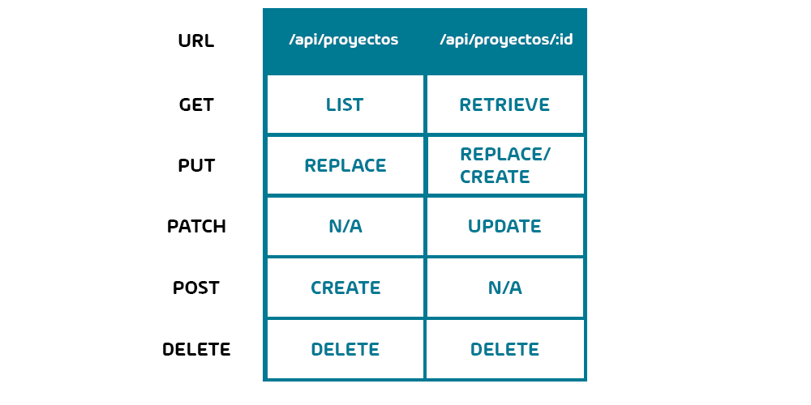

# Que es REST
REST (Representational state transfer) es un estilo de arquitectura para construir web services. No es un estandar pero si existe una especificación creada por Roy Fielding que es el coofundador de Apache.

## De qe se trata rest

Se tiene la siguiente tabla

/api/proyectos nos va a exponer la coleccion de proyectos y /api/proyectos/:id nos va a exponer el proyecto especifico por id

si nosotros hacemos uns http get a /api/proyectos tenemos la lista completa de los proyectos. si se hace en la dirección especifica se obtiene la pelicula especifica

Si hacemos un put en la colección vamos a reemplazar todos los proyectos por lo tanto no es muy recomendable. si se hace al proyecto especifico vamos a reemplazar ese proyecto o creamos uno nuevo

Si hacemos un patch en proyectos no es disponible ya que no tiene sentido y se tiene que hacer especifico. Por eso es que el patch se hace directamente a la pelicula por el id

Si hacemos un post en la colección de proyectos vamos a crear un proyecto. No tiene sentido hacerlo en el proyecto especifico porque lo vamos a crear un por ahora no existe.

Si hacemos un delete sobre la colección se borra todo por lo tanto tampoco es recomendable. Si hacemos un delete sobre el proyecto especifico se borra ese en especifico

# Como implementar un CRUD

CRUD de la siblas Create Read Updata and Delete (Crear Leer Actualizar y Borrar). La manera que vamos a hacerlos especificando las rutas

GET responde un staus de 200
POST responde un status de 201
PATCH responde un status de 200
DELETE responde un status de 200
